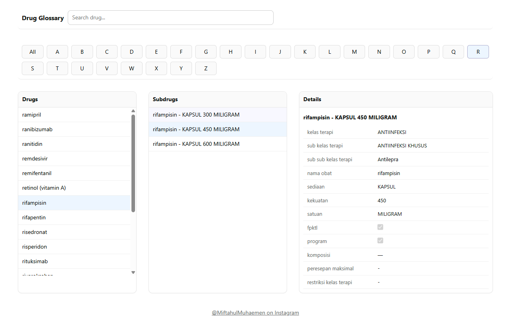

# Drugstore Glossary

Pharmacists must review detailed drug information before dispensing medication, some drugs require specific conditions to be met before they can be given to patients. In practice, pharmacists often reference this information from scattered sources, sometimes even searching through old WhatsApp chats.

The official e-Fornas Kemkes site lists drugs, but omits these critical requirements. This project was created to clone the drug list and enrich it with essential details that are missing from the official source, making it easier for pharmacists to access all necessary information in one place.



A static drug glossary site crawled from https://e-fornas.kemkes.go.id/guest/daftar-obat.


## Flow Process

1. **Crawl Data**
   - Use `/notebook/drugs.ipynb` to scrape with Selenium and generate `data/data.json` from the source.

2. **Static Site Generation**
   - Build the static website with Node.js scripts.
   - The frontend fetches drug data from the local `data/data.json`.

3. **Deployment**
   - Deploy the built site to GitHub Pages for public access as a static website.
   - Attach custom domain https://sipamanobat.my.id/
   - Protect with Cloudflare

## Project Structure

```
drugstore/
├── .github/        # GitHub Actions workflow
├── notebook/       # Crawler and ouput JSON
├── public/         
├── dist/           # Built static site (auto-generated)
├── index.html    
└── src/
   ├── assets/             
   ├── components/         # React components
   ├── hooks/              # Custom hooks
   └── types/              # TypeScript definitions
```

## Quick Start

### Prerequisites
- Node.js 20+
- npm

### Installation
```bash
npm install
npm run dev       # Start development server
npm run build     # Build for production
npm run test      # Run tests
npm run lint      # Run ESLint
```

## Deployment

The site automatically deploys to GitHub Pages via GitHub Actions when code is pushed to the `main` branch.

**Live Site**: [https://sipamanobat.my.id/](https://sipamanobat.my.id/)
